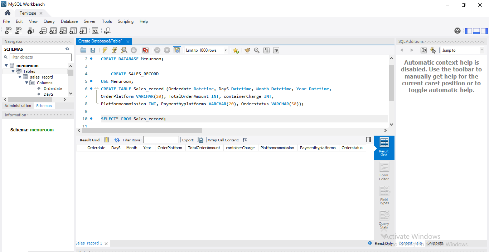

# Welcome to My Github Repository - An Overview
This Repository is dedicated to examining the data analysis process in SQL. Here, i plan to showcase the process of data analysis in SQL, from data extraction to insight generation. Stay tuned for a detailed exploration of SQL data analysis techniques and methodologies.

## SQL Projects, Techniques, and Manipulations Overview
1. Database Creation:
  * Creating a new database using CREATE DATABASE.
  * Defining tables with CREATE TABLE and specifying column attributes.

For this database creation, i will be creating a database and tables specifying column attributes for an online restaurant called "Menuroom", which specializes in supplying cooked meals to customers through the online platforms like Jumia, Boltfood, Glovo and Chowdeck.
Picture description below:

